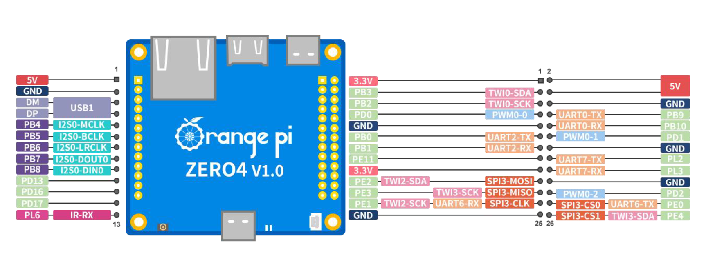

# Orange Pi Zero 4
This was the best board I could find for this project because it was tiny, easy to get a hold of, affordable, had a ton of I/O options, and more than enough power for my uses while being super efficient. 

### Specs
- Allwinner A733 SOC
- 4gb RAM

### Pinout
